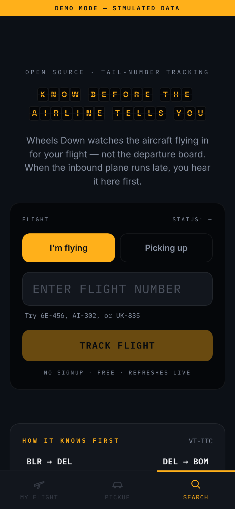
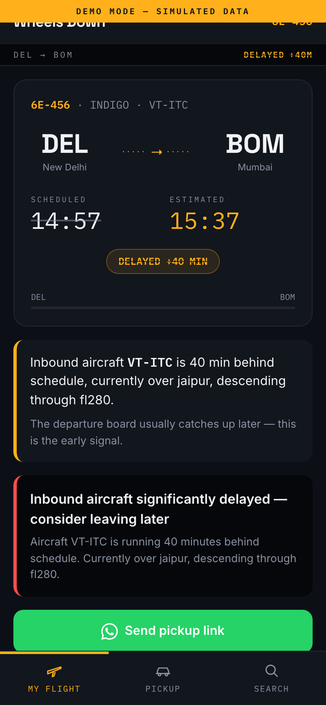
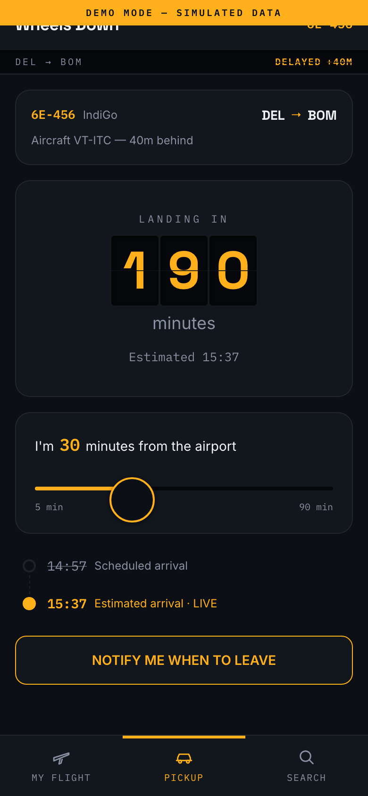
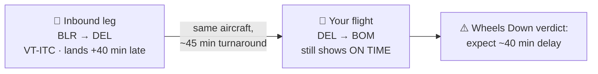

# ✈️ Wheels Down

**Know before the airline tells you.**

Wheels Down is an open-source flight delay predictor and airport-pickup timer. Instead of watching the departure board, it watches the **physical aircraft** assigned to your flight — because your plane is late long before your flight officially is.

<!-- After deploying, replace with your live URL -->
**Live demo:** https://wheels-down.vercel.app *(runs in demo mode — no API key, no signup, try flights `6E-456`, `AI-302`, `UK-835`)*

[](LICENSE)
[](https://nextjs.org)
[](src/lib/__tests__)

<p align="center">
  
  
  
</p>

---

## The insight

A late-arriving aircraft is one of the biggest single causes of flight delays. Airlines know your departure will slip the moment the inbound leg falls behind — but the departure board often doesn't say so until much later.

The aircraft itself can't hide, though. Every flight is flown by a physical plane with a public registration (tail number), and its previous leg is publicly trackable:



So the pipeline is:

1. **Resolve the tail number** — which physical aircraft flies your flight number today.
2. **Watch its inbound leg** — where that aircraft is right now, and how late it's running.
3. **Give a verdict early** — the inbound delay propagates through the turnaround to your departure, before the board updates.

## Two personas, one tracker

| | **I'm flying** | **Picking up** |
|---|---|---|
| Question | "Should I leave for the airport as planned?" | "When exactly do I leave to catch the landing?" |
| Answer | Delay verdict from inbound-aircraft tracking | Live landing countdown + a **leave-by time** from your distance to the airport |
| Share | — | One-tap WhatsApp link (`/track/6E-456/2026-07-04`) — send it to whoever's driving; no app, no account |

The pickup persona is the hero feature: family pickups are a ritual, and "leave by 18:42" is useful even when delay prediction is fuzzy.

## Quick start

```bash
npm install
npm run dev        # http://localhost:3000 — demo mode, no keys needed
npm test           # unit tests for the delay/pickup logic
```

Demo mode serves three simulated flights covering the interesting cases:

| Flight | Scenario |
|---|---|
| `6E-456` | Inbound aircraft running 40 min late — the board doesn't know yet |
| `AI-302` | Everything on time |
| `UK-835` | Cancelled, inbound grounded |

## Going live with real data

The data layer is a single interface with pluggable providers:

```ts
export interface FlightDataProvider {
  readonly id: string;
  readonly isLive: boolean;   // false ⇒ UI shows the demo banner
  getFlight(query: FlightQuery): Promise<FlightData | null>;
}
```

| Provider | Selected by | Needs |
|---|---|---|
| `MockProvider` (default) | `FLIGHT_PROVIDER=mock` | nothing |
| `Fr24Provider` | `FLIGHT_PROVIDER=fr24` | `FR24_API_TOKEN` from the [Flightradar24 API](https://fr24api.flightradar24.com) — the $9/mo Explorer tier covers roughly 100–200 tracked flights/month at a 5-minute poll interval |

Copy `.env.example` to `.env.local` and fill it in. Adding another source (AeroDataBox, OpenSky, an airline API) means implementing one interface in [`src/lib/providers/`](src/lib/providers).

> **Honesty note:** the FR24 mapping in [`fr24.ts`](src/lib/providers/fr24.ts) follows the published v1 docs but field availability varies by subscription tier — treat it as a well-documented starting point and verify against your own key.

## Architecture

```
src/
├── app/
│   ├── page.tsx                      # server component — picks provider, renders app
│   ├── api/flight/[flightId]/[date]/ # the only place providers are called
│   ├── track/[flightId]/[date]/      # shareable pickup countdown
│   └── check/[flightId]/[date]/      # shareable delay verdict
├── components/                       # SearchView, FlightStatusPanel, PickupPanel, …
└── lib/
    ├── types.ts                      # FlightData domain model
    ├── flightLogic.ts                # pure functions: verdicts, pickup math, formatting
    ├── providers/                    # the data seam: mock + FR24
    └── __tests__/                    # vitest unit tests
```

Design decisions worth calling out:

- **All times are ISO 8601 instants**, never bare `HH:mm` strings. Rendering picks the right wall clock per context: arrival times display in the **destination airport's** timezone; the leave-by time displays in the **viewer's** timezone (the driver reads their own watch). This survives cross-midnight arrivals and viewers abroad — there's a test for each.
- **Providers are server-side only.** The client only ever talks to `/api/flight/…`, so API tokens never reach the browser and swapping providers touches zero UI code.
- **`flightLogic.ts` is pure** — time-dependent functions take `now` as a parameter, which is what makes the countdown math unit-testable.

## Honest limitations

This is a working demonstration of the idea, not a finished product:

- **Delay prediction is a heuristic**, not ML: inbound running X min late ⇒ expect roughly X min delay after the turnaround. Airlines can make up time in the air and in fast turnarounds.
- **Notifications only fire while the page is open.** There's no push backend; iOS web push additionally requires home-screen install.
- **First flights of the day** have no inbound leg to watch — the signal doesn't exist before the aircraft's first rotation.
- **Tail-number resolution can be wrong** when airlines swap aircraft late; a production version would re-verify near departure.

## Roadmap

- [ ] Deploy demo to Vercel
- [ ] Verify FR24 field mapping with a live Explorer key
- [ ] Airport-aware turnaround times (metro hubs turn faster than regional)
- [ ] Web push via service worker for the leave-by alert
- [ ] WhatsApp bot as the notification channel

## License

[MIT](LICENSE) — do whatever you like, a mention is appreciated.
